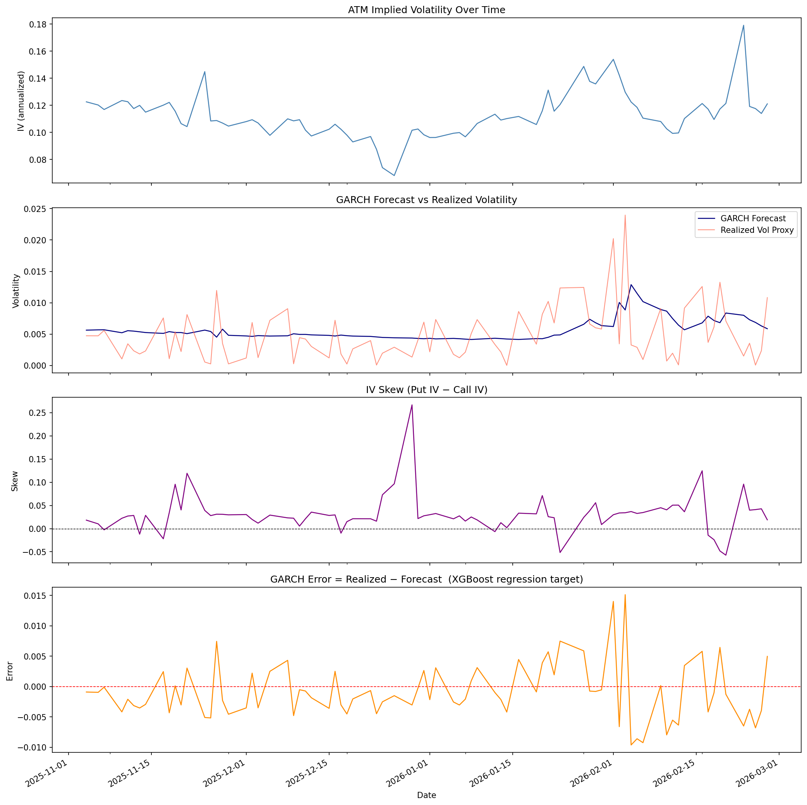
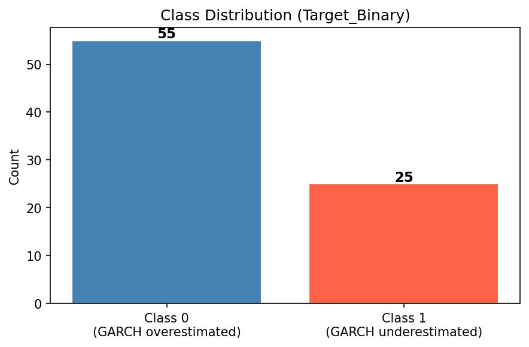
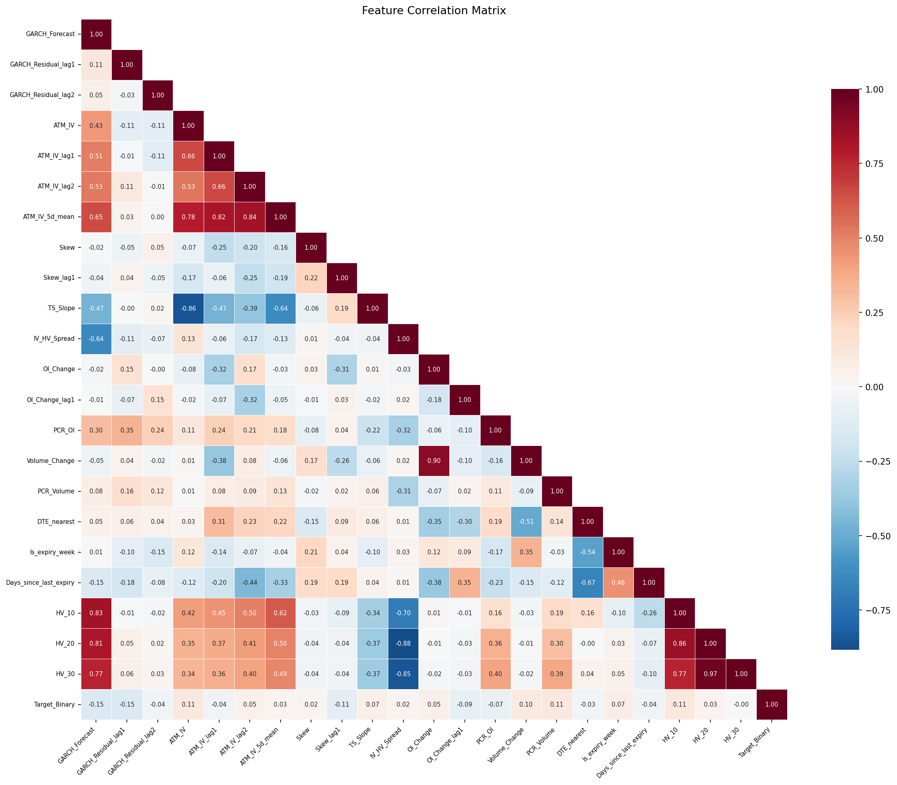
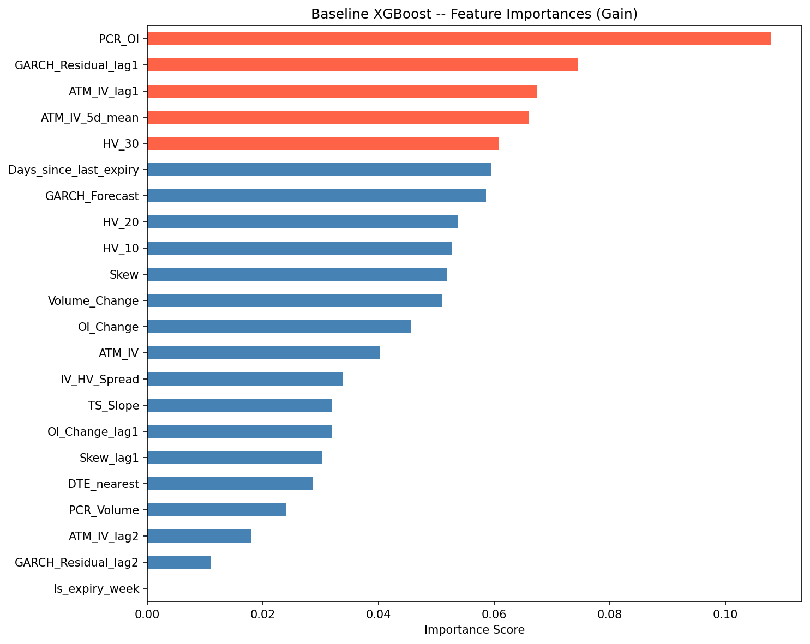
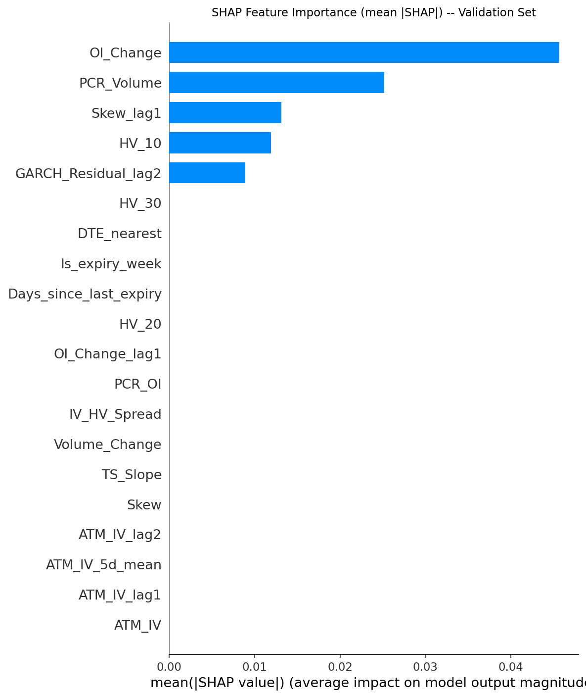
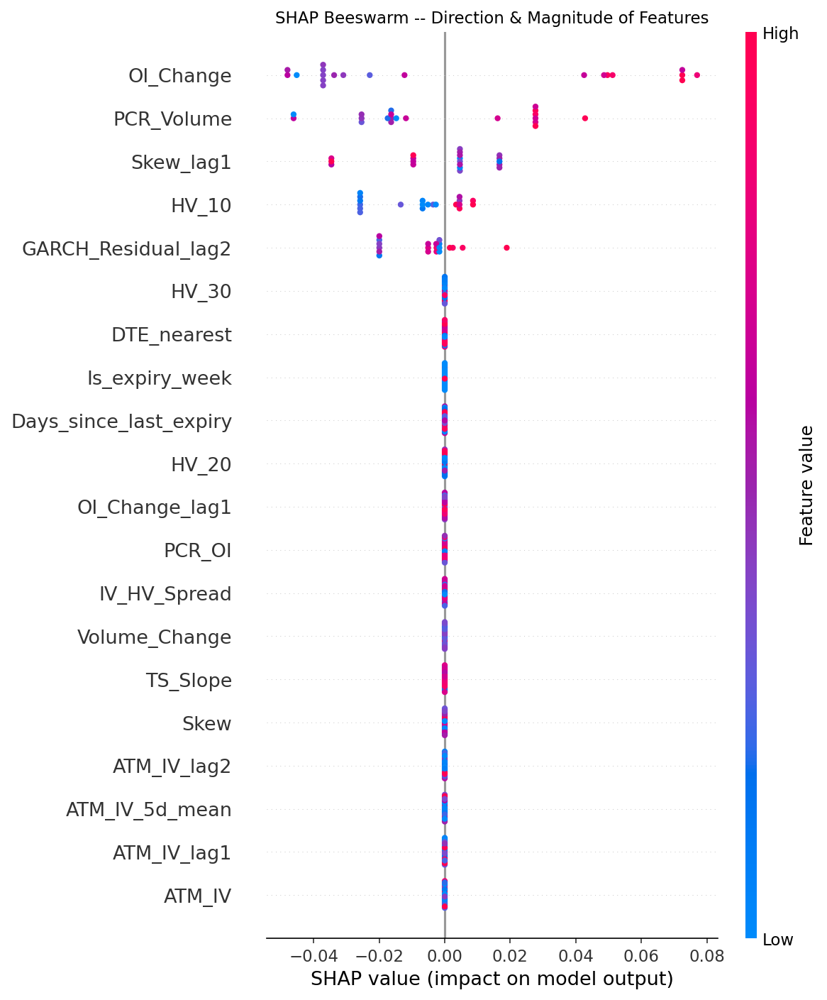
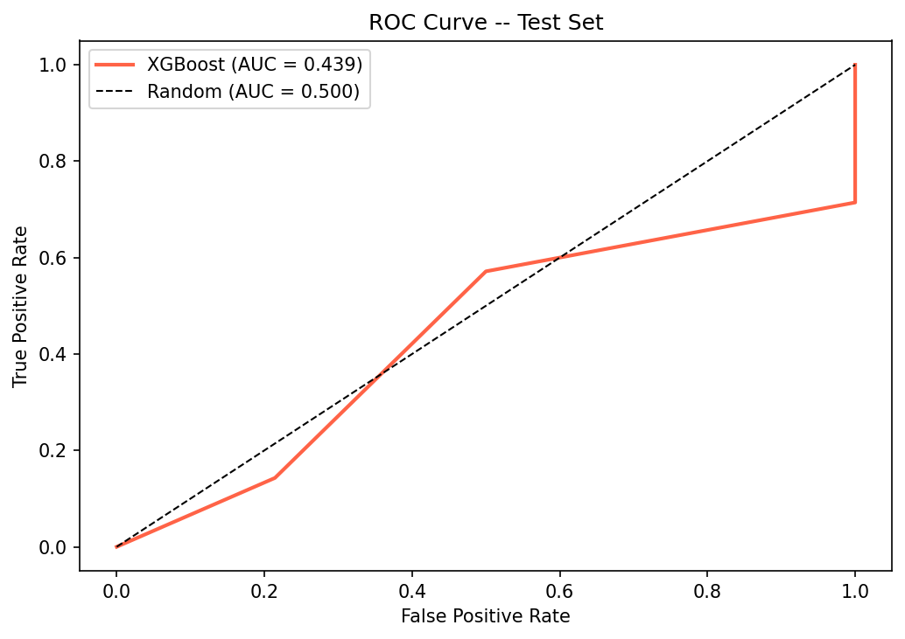
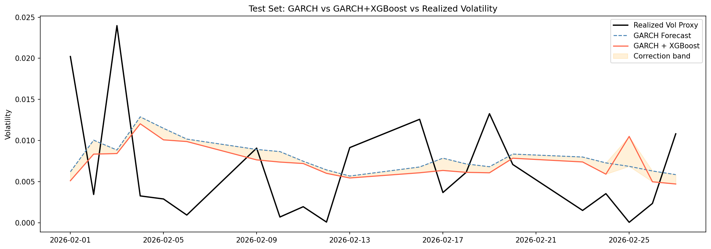

# BANKNIFTY Volatility Forecasting Pipeline

A two-stage volatility forecasting system for BANKNIFTY options using **GARCH(1,1) + XGBoost**. The pipeline ingests raw NSE options data, computes implied volatility, builds a daily feature table, fits a rolling GARCH model, and then trains an XGBoost model to correct GARCH's systematic blind spots using options market signals.

**Author:** Divyansh Pathak — [divyansh.pathak129@gmail.com](mailto:divyansh.pathak129@gmail.com)

---

## How It Works

```
Stage 1 — GARCH(1,1)
  Spot returns  →  baseline volatility forecast

Stage 2 — XGBoost correction
  GARCH forecast + options signals (IV, skew, OI, volume, term structure)
  →  predict whether GARCH under/overestimates tomorrow's vol
  →  Final forecast = GARCH forecast ± XGBoost correction
```

GARCH only sees historical price returns. It is blind to options market signals — OI spikes, skew surges, expiry effects. XGBoost learns these patterns from the residuals GARCH leaves behind.

---

## Repository Structure

```
stockspipeline/
├── preprocess.py                    # Full data pipeline (Phases 1–7)
├── xgboost_volatility_model.py      # XGBoost model (Phases 0–8)
├── xgboost_volatility_model_plan.md # Detailed implementation plan
├── parquet_viewer.py                # Utility to inspect .parquet files
├── BANK_NIFTY_Data1/                # Raw NSE monthly Excel files (input)
│   ├── BANK_NIFTY_AUG25.xlsx
│   ├── BANK_NIFTY_SEP25.xlsx
│   └── ...
├── data/
│   ├── raw/                         # master_raw.parquet
│   ├── processed/                   # master_filtered.parquet, master_with_iv.parquet
│   └── features/                    # final_features.parquet, final_features.csv
├── assets/                          # Output plots (committed for README display)
├── models/                          # Trained XGBoost models (.ubj, .pkl)
├── outputs/                         # Plots and forecast CSV (gitignored)
└── .gitignore
```

---

## Requirements

**Python 3.10+**

```bash
pip install pandas numpy scipy arch xgboost scikit-learn shap \
            matplotlib seaborn joblib pyarrow openpyxl
```

---

## Quickstart

### Step 1 — Add raw data

Place NSE BANKNIFTY options monthly Excel files in `BANK_NIFTY_Data1/`. Files must follow the naming pattern `BANK_NIFTY_<MON><YY>.xlsx` (e.g. `BANK_NIFTY_MAR26.xlsx`).

Each file should contain these columns from NSE:

| Column | Description |
|--------|-------------|
| `Date` | Trading date |
| `CONTRACT_D` | Contract descriptor e.g. `OPTIDXBANKNIFTY01-AUG-2025CE45000` |
| `CLOSE_PRIC` | Option close price |
| `SETTLEMENT` | Settlement price (fallback if close is NaN) |
| `UNDRLNG_ST` | Underlying spot price |
| `OI_NO_CON` | Open interest (number of contracts) |
| `TRADED_QUA` | Traded quantity / volume |

### Step 2 — Run the preprocessing pipeline

```bash
python preprocess.py
```

This runs all 7 preprocessing phases and writes:

| Output file | Description |
|-------------|-------------|
| `data/raw/master_raw.parquet` | All months merged, raw |
| `data/processed/master_filtered.parquet` | After liquidity filters |
| `data/processed/master_with_iv.parquet` | With computed implied volatility |
| `data/processed/daily_pre_lags.parquet` | Daily features + GARCH outputs |
| `data/features/final_features.parquet` | Final feature table (model input) |
| `data/features/final_features.csv` | Same, in CSV format |

> **Note:** IV computation runs in parallel using `joblib` and may take 5–15 minutes depending on your CPU and data size.

### Step 3 — Train the XGBoost model

```bash
python xgboost_volatility_model.py
```

This runs all 8 model phases and writes:

| Output | Description |
|--------|-------------|
| `models/xgb_classifier.ubj` | Trained classifier (XGBoost native format) |
| `models/xgb_classifier.pkl` | Trained classifier (joblib pickle) |
| `models/xgb_regressor.ubj` | Trained regressor for correction magnitude |
| `models/xgb_regressor.pkl` | Trained regressor (joblib pickle) |
| `outputs/eda_signals.png` | ATM IV, GARCH vs realized vol, skew, GARCH error over time |
| `outputs/class_balance.png` | Target class distribution |
| `outputs/correlation_heatmap.png` | Feature correlation matrix |
| `outputs/feature_importances_baseline.png` | Baseline XGBoost feature importances |
| `outputs/shap_importance.png` | SHAP mean absolute importance (val set) |
| `outputs/shap_beeswarm.png` | SHAP beeswarm — direction and magnitude |
| `outputs/roc_curve.png` | ROC curve on test set |
| `outputs/forecast_comparison.png` | GARCH vs GARCH+XGBoost vs realized vol |
| `outputs/test_set_forecasts.csv` | Per-day forecasts with corrections on test set |

---

## Sample Outputs

### EDA — ATM IV, GARCH vs Realized Vol, Skew, GARCH Error



---

### Class Balance — GARCH Over vs Underestimation



---

### Feature Correlation Matrix



---

### Baseline XGBoost Feature Importances



---

### SHAP — Global Feature Importance



---

### SHAP — Direction and Magnitude of Each Feature



---

### ROC Curve — Test Set



---

### Forecast Comparison — GARCH vs GARCH+XGBoost vs Realized Vol



---

## Configuration

Key parameters live at the top of each script:

### `preprocess.py`

| Parameter | Default | Description |
|-----------|---------|-------------|
| `RISK_FREE_RATE` | `0.065` | RBI repo rate used in Black-Scholes IV calculation |
| `OI_MIN` | `50` | Minimum open interest to include a contract |
| `MONEYNESS_LOW` | `0.80` | Lower bound for strike/spot moneyness filter |
| `MONEYNESS_HIGH` | `1.20` | Upper bound for moneyness filter |
| `DTE_MIN` | `1` | Minimum days to expiry |
| `DTE_MAX` | `90` | Maximum days to expiry |
| `IV_MAX` | `2.0` | Cap IV at 200% annualized — higher is likely a data error |
| `GARCH_WARMUP` | `60` | Trading days used to warm up the rolling GARCH window |

### `xgboost_volatility_model.py`

| Parameter | Default | Description |
|-----------|---------|-------------|
| `TRAIN_END` | `"2025-12-31"` | Last date of training set |
| `VAL_END` | `"2026-01-31"` | Last date of validation set (test = everything after) |

Update `TRAIN_END` and `VAL_END` to match your actual data range whenever you add new monthly files.

---

## Features Used by the Model

The model uses 22 features derived from options data and GARCH outputs:

| Feature | Source | Description |
|---------|--------|-------------|
| `GARCH_Forecast` | GARCH | One-day-ahead volatility forecast |
| `GARCH_Residual_lag1/2` | GARCH | Lagged standardized residuals |
| `ATM_IV`, `ATM_IV_lag1/2` | Options | At-the-money implied volatility and lags |
| `ATM_IV_5d_mean` | Options | 5-day rolling mean of ATM IV |
| `Skew`, `Skew_lag1` | Options | Put IV (0.95m) minus Call IV (1.05m) |
| `TS_Slope` | Options | Term structure: far expiry IV minus near expiry IV |
| `IV_HV_Spread` | Derived | ATM IV minus 20-day historical volatility |
| `OI_Change`, `OI_Change_lag1` | Options | Daily change in total open interest |
| `PCR_OI` | Options | Put-call ratio by open interest |
| `Volume_Change` | Options | Daily change in total traded volume |
| `PCR_Volume` | Options | Put-call ratio by volume |
| `DTE_nearest` | Calendar | Days to nearest expiry |
| `Is_expiry_week` | Calendar | 1 if within 5 days of expiry, else 0 |
| `Days_since_last_expiry` | Calendar | Days elapsed since last expiry date |
| `HV_10`, `HV_20`, `HV_30` | Returns | Historical volatility over 10/20/30-day windows |

---

## Target Variable

**Classification (primary):** `Target_Binary`
- `1` — GARCH underestimated realized volatility (positive GARCH error)
- `0` — GARCH overestimated realized volatility

**Regression (secondary):** `Target_Regression`
- The exact signed error: `Realized_Vol_proxy − GARCH_Forecast`
- Used by the regressor to compute the correction magnitude

---

## Performance Notes

Model performance scales heavily with the amount of data. With more months of data:

| Training rows | Expected val accuracy |
|---------------|----------------------|
| ~40 rows | Overfits — unreliable |
| ~150 rows | 55–60% realistic |
| ~250+ rows | 60–65% achievable |

To add more data, drop new monthly files into `BANK_NIFTY_Data1/` and rerun both scripts from scratch. No other changes needed.

A 60% classification accuracy on financial time series is considered excellent. The more meaningful metric for live trading use is **direction accuracy** — whether the combined forecast is closer to realized vol than GARCH alone.

---

## Using the Trained Model

Once you have run both scripts, the trained models sit in `models/`. Here is how to load them and get a forecast for a new day.

### What you need as input

To forecast for **tomorrow**, you need today's feature row — the same 22 columns the model was trained on. The easiest way is to pull the last row from `final_features.parquet` after running the pipeline on fresh data.

```python
import pandas as pd
import xgboost as xgb
import numpy as np

FEATURE_COLS = [
    "GARCH_Forecast", "GARCH_Residual_lag1", "GARCH_Residual_lag2",
    "ATM_IV", "ATM_IV_lag1", "ATM_IV_lag2", "ATM_IV_5d_mean",
    "Skew", "Skew_lag1", "TS_Slope", "IV_HV_Spread",
    "OI_Change", "OI_Change_lag1", "PCR_OI", "Volume_Change", "PCR_Volume",
    "DTE_nearest", "Is_expiry_week", "Days_since_last_expiry",
    "HV_10", "HV_20", "HV_30",
]

# Load today's features (last row of the pipeline output)
features = pd.read_parquet("data/features/final_features.parquet")
today = features[FEATURE_COLS].iloc[[-1]]  # shape (1, 22)
```

### Get the classification signal

The classifier tells you whether GARCH is likely **underestimating** tomorrow's volatility.

```python
clf = xgb.XGBClassifier()
clf.load_model("models/xgb_classifier.ubj")

predicted_class = clf.predict(today)[0]
probability     = clf.predict_proba(today)[0][1]

if predicted_class == 1:
    print(f"GARCH likely UNDERESTIMATES tomorrow's vol  (confidence: {probability:.1%})")
else:
    print(f"GARCH likely OVERESTIMATES tomorrow's vol  (confidence: {1 - probability:.1%})")
```

### Get the corrected volatility forecast

The regressor predicts the exact correction to apply on top of GARCH's forecast.

```python
reg = xgb.XGBRegressor()
reg.load_model("models/xgb_regressor.ubj")

garch_forecast  = features["GARCH_Forecast"].iloc[-1]
xgb_correction  = reg.predict(today)[0]
final_forecast  = garch_forecast + xgb_correction

print(f"GARCH forecast:          {garch_forecast*100:.3f}%")
print(f"XGBoost correction:      {xgb_correction*100:+.3f}%")
print(f"Final vol forecast:      {final_forecast*100:.3f}%")
print(f"Annualized (x sqrt252):  {final_forecast * np.sqrt(252) * 100:.2f}%")
```

### Practical workflow for live use

```
Every evening after market close:
  1. Download today's NSE BANKNIFTY options bhavcopy
  2. Append it to BANK_NIFTY_Data1/ as a new or updated monthly file
  3. Run: python preprocess.py
  4. Run the 3 code blocks above to get tomorrow's forecast
```

> **Retrain periodically.** Re-run `xgboost_volatility_model.py` every month or two as you accumulate more data. Update `TRAIN_END` and `VAL_END` to reflect the new date range before retraining.

### Reading `outputs/test_set_forecasts.csv`

This file shows the model's performance day-by-day on the held-out test set:

| Column | Description |
|--------|-------------|
| `GARCH_Forecast` | Raw GARCH one-day-ahead vol forecast |
| `GARCH_Error` | How wrong GARCH was (realized − forecast) |
| `Realized_Vol_proxy` | Actual realized volatility for that day |
| `Target_Binary` | Ground truth (1 = GARCH underestimated) |
| `XGB_Predicted_Class` | Model's prediction (1 or 0) |
| `XGB_Pred_Probability` | Confidence score (0–1) for class 1 |
| `XGB_Correction` | Correction the regressor applied |
| `Final_Forecast` | `GARCH_Forecast + XGB_Correction` |
| `Correct_Direction` | 1 if the model predicted direction correctly |

---

## Inspect Parquet Files

To quickly inspect any intermediate dataset:

```bash
python parquet_viewer.py data/features/final_features.parquet
python parquet_viewer.py data/processed/master_with_iv.parquet
```

---

## License

MIT License — free to use, modify, and distribute with attribution.

---

## Contributing

Pull requests are welcome. If you're adding support for other indices (NIFTY 50, FINNIFTY) or alternate volatility models (EGARCH, GJR-GARCH), please open an issue first to discuss the approach.
